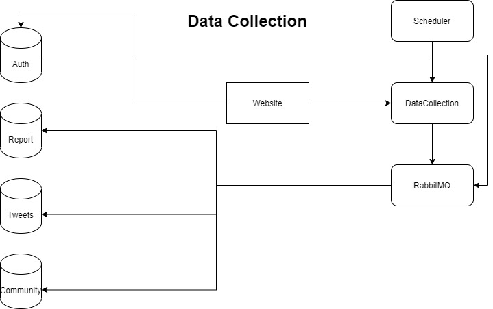
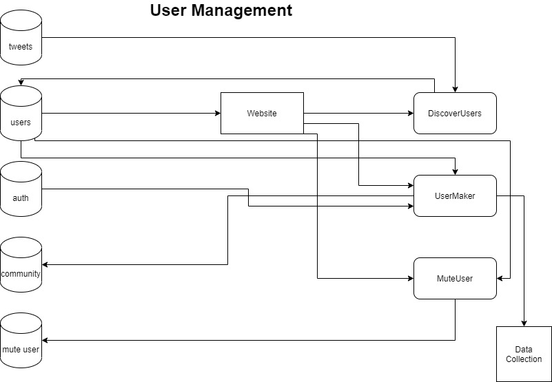
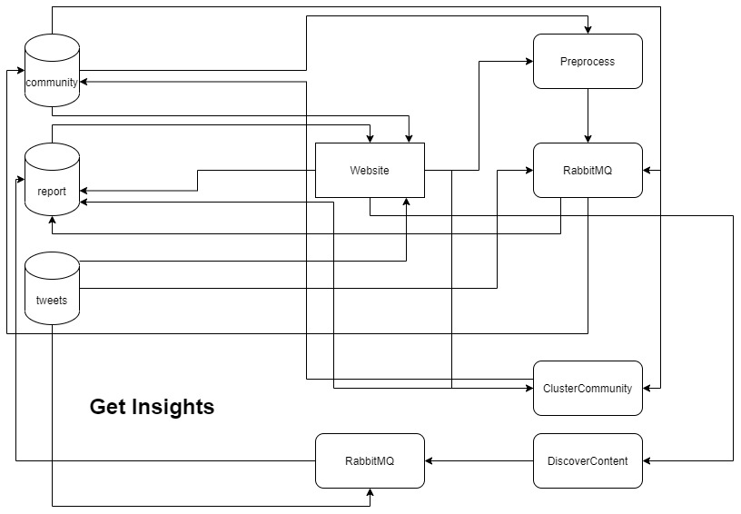

# Discover Weekly Twitter

### Introduction:

This project is the continuation of [discover weekly twitter](https://github.com/sameerpixelbot/discover-weekly-twitter). This is a deployable version of the previous project. Here we will discuss about the architecture of the deployed project, how to use and how to add additional functionalities. To know how the projects work go to [discover weekly twitter](https://github.com/sameerpixelbot/discover-weekly-twitter).

### Architecture:

We have deployed the project in a micro-service format. So we have a Frontend website and many backend micro-services.  

The project is divided into 3 parts:  
1. Data Collection
2. User Management
3. Get Insights  

Lets divide each one of them in two parts Frontend and Backend.

### Data Collection:  

This is the part we collect data

#### Frontend:

- The first part is on Twitter API Keys
- On the website we can add a new API key as well as delete the API key, its stored in the MongoDB database which is as a docker container
- The next part is about the status of data collection
- Here we can see the amount of tweets scraped, time frame of the tweets, we can also see the status of different events like the tweets collected after discovering new users, adding new users manually as well as by the daily scheduler
- We can adjust the time at which we want to automate the scheduling process on the website

#### Backend:

- The scheduler send request to the data collector according to the schedule set by the user
- Once the data collector receives the request either from the scheduler or any other part of the system such as the website it does a process
- It uses Celery, RabbitMQ to process its task asynchronously
- It uses this to parallelly run two or more tasks which are time taking
- Task such as tweets collection cant be done in multiple instance as we can collect tweets using only one API key
- When it comes to user meta data collections can be done with multiple API keys so we can split users and collect their meta data parallelly
- We can increase the amount of tasks run parallelly by just increasing the no of containers of RabbitMQ
- The above statement can be done by increasing the replicas of the container using the docker-compose file
- All the data is stored in MongoDB

### User Management:

Here we manage the users in the community

#### Frontend:

- The first part of this section is Add users
- We can either Add or Delete a user in this part
- The next part is discover users
- Here we get recommended the top 30 users who are not yet in our community who are interacting a lot with the people of our community

#### Backend:

- Once we Add users or discover users the website is going to send request to data collector service to collect their tweets as well as their meta data
- Once we finalize the users we added or discovered the website sends request to two services user maker, user muter
- User maker adds them to the community in the Database
- User muter adds the muted and blocked users to the muted collection in our data base

### Get Insights:

Here we can analyze the data

#### Frontend:

- So here we can adjust the weights of interactions on the front end in the preprocess section
- In the cluster community section we can see all the clusters and toggle through all the clusters
- In the discover content section we can see all the content corresponding to these clusters

#### Backend:

- Once we adjust weights and command to preprocess website sends request to preprocess
- The preprocess service then sends tasks to RabbitMQ in order to compute it parallelly and thus speeding the process of bond weight calculation
- Here we divide the users among the containers
- Once we look for clusters the website sends request to cluster community service
- Then the service clusters the community and updates in the database
- Similarly the discover content service forms the conversations from the tweets and  updates the conversations based on their cluster and tier they belong

### Adding Functionalities:

- In order to add extra functionalities like predicting user interests etc.
- We can add them using new containers and add accordingly new changes to the website

### Technologies used:

- Python, NoSQL
- Dockers, MongoDB, Twitter API
- Sklearn, Igraph, DBSCAN, Infomap, Tweepy, Stream lit

### Future:

- Adding multiple user support to really make use of micro services architecture
- Adding login, authentication
